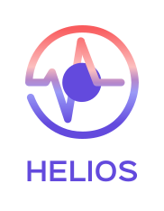

<dl>
  <dt><strong>Pour</strong></dt>
  <dd>les agents de la Direction d’offre de soin et d’autonomie des ARS</dd>
  <dt><strong>qui veulent</strong></dt>
  <dd>un accès rapide, personnalisé et centralisé aux données de pilotage liées à la santé,</dd>
  <dt><strong>notre</strong></dt>
  <dd>produit <b><em>Helios</b></em></dd>
  <dt><strong>propose</strong></dt>
  <dd>un gain de temps, une vision transverse et globale des établissement de santé et médico-sociaux avec des données utiles, fiables et mutualisées</dd>
  <dt><strong>et vise</strong></dt>
  <dd>à devenir 6 mois après le déploiement général l’outil de synthèse de référence pour toutes les ARS avec une prise en main intuitive et des mises à jour fluides, fréquentes et attendues.</dd>
</dl>

Pour participer au développement, consulter notre [contributing](./CONTRIBUTING.md).
