# Données DIAMANT

## Présentation

DIAMANT (Décisionnel Inter-ARS pour la Maîtrise et l'Anticipation) est le système d'information de la DGOS pour le suivi de l'activité, des finances et des ressources humaines des établissements de santé.

## Sources DIAMANT utilisées

- **ANN_ERRD_EJ_ET** : données annuelles ERRD (entités juridiques et établissements territoriaux)
- **ANN_MS_TDP_ET** : données médico-sociales TDP (établissements territoriaux)
- **MEN_PMSI_ANNUEL** / **MEN_PMSI_MENCUMU** : données PMSI mensuelles
- **ANN_RPU** : données urgences annuelles
- **ANN_SAE** : données SAE annuelles (mise à jour en septembre de l'année)
- **ANN_CA_EJ_ET** : données comptes annuels
- **QUO_SAN_FINANCE** : données financières sanitaires
- **MEN_HAPI** : données HAPI mensuelles

## Processus de la réception de la donnée à l'affichage

### Pipeline ETL DIAMANT

```mermaid
flowchart LR
    A[SFTP DNUM<br/>DIAMANT/incoming] -->|Fichiers chiffrés| B[Récupération]
    B --> C{Déchiffrement}
    C -->|Clés coffre fort| D[Vérification intégrité]
    D --> E[Transformation<br/>Datacrawler]
    E --> F[Parse fichiers DIAMANT]
    F --> G[Normalisation schéma Helios]
    G --> H[Calcul indicateurs dérivés]
    H --> I[Vérification cohérence<br/>FINESS, années]
    I --> J[Rapprochement FINESS]
    J --> K[Chargement BDD]
    K --> L[Tables indicateurs]
    L --> M[Affichage fiches<br/>et comparaisons]
    
    style A fill:#e1f5ff
    style C fill:#fff4e1
    style E fill:#e8f5e9
    style K fill:#f3e5f5
    style M fill:#e8f5e9
```

### 1. Récupération

- **Source** : serveur SFTP DNUM
- **Dossier** : `DIAMANT/incoming`
- **Format** : fichiers chiffrés (nécessitent déchiffrement)
- **Fréquence** : hebdomadaire (varie selon le type de fichier)

### 2. Déchiffrement


**Fichiers chiffrés** : Les fichiers DIAMANT sont chiffrés et nécessitent un déchiffrement avec les clés stockées dans un coffre fort sécurisé avant traitement.


- Les fichiers DIAMANT sont chiffrés
- Déchiffrement avec les clés stockées dans un coffre fort sécurisé
- 
**Vérification d'intégrité** : Après déchiffrement, une vérification de l'intégrité des fichiers est effectuée pour s'assurer que les données n'ont pas été corrompues.


### 3. Transformation

Le datacrawler :
- Parse les fichiers (format spécifique DIAMANT)
- Normalise les données selon le schéma Helios
- Calcule les indicateurs dérivés
- Vérifie la cohérence (FINESS, années, etc.)
- Gère les rapprochements avec les données FINESS

### 4. Chargement

- Insertion/mise à jour dans les tables d'indicateurs :
  - `activite_sanitaire`
  - `activite_medico_social`
  - `activite_sanitaire_mensuel`
  - `budget_et_finances_sanitaire`
  - `budget_et_finances_medico_social`
  - `budget_et_finances_entite_juridique`
  - `ressources_humaines_sanitaire`
  - `ressources_humaines_medico_social`
  - `ressources_humaines_entite_juridique`

### 5. Affichage

Les données DIAMANT alimentent :
- Bloc Activité des fiches
- Bloc Budget & Finances
- Bloc Ressources Humaines
- Tableaux de comparaison

## Fréquence de réception


**ANN_SAE** : Les données SAE sont mises à jour en septembre de l'année. Un rappel est envoyé à DIAMANT pour s'assurer de la réception des données.


- **ANN_SAE** : mise à jour en septembre de l'année (rappel à Diamant de nous envoyer les données)
- **Autres fichiers** : fréquences variables selon le calendrier DIAMANT
- **Traitement** : hebdomadaire après réception

## Dates de mise à jour

Les dates de dernière mise à jour sont stockées dans `date_mise_a_jour_fichier_source` et affichées sur les fiches.

## Voir aussi

- [Récupération des données](recuperation-donnees/README.md)
- [SFTP/API](recuperation-donnees/sftp-api.md)
