# Données FINESS

## Présentation

FINESS (Fichier National des Établissements Sanitaires et Sociaux) est le référentiel national des établissements de santé et médico-sociaux.

## SI Autorisations

Les données FINESS incluent notamment les **autorisations sanitaires** (SI Autorisations) gérées par l'ARHGOS.

## Processus de la réception de la donnée à l'affichage

### Pipeline ETL FINESS

```mermaid
flowchart LR
    A[SFTP DNUM<br/>Fichiers FINESS] -->|CS1400101-5<br/>CS1600101-2<br/>AMM_ARHGOS| B[Récupération quotidienne]
    B --> C[Transformation<br/>Datacrawler]
    C --> D[Parse XML/CSV]
    D --> E[Normalisation données]
    E --> F[Vérification cohérence<br/>FINESS, dates]
    F --> G[Enrichissement référentiels<br/>catégories, régions]
    G --> H[Chargement BDD]
    H --> I[Tables principales<br/>etablissement_territorial<br/>entite_juridique<br/>autorisation_sanitaire_amm]
    I --> J[Mise à jour table<br/>recherche indexée]
    J --> K[Affichage fiches<br/>et résultats recherche]
    
    style A fill:#e1f5ff
    style C fill:#e8f5e9
    style H fill:#f3e5f5
    style K fill:#e8f5e9
```

### 1. Récupération

- **Source** : serveur SFTP DNUM
- **Fichiers** :
  - CS1400101-5 : établissements territoriaux
  - CS1600101-2 : entités juridiques
  - AMM_ARHGOS : autorisations sanitaires
- **Fréquence** : quotidienne

### 2. Transformation

Le datacrawler :
- Parse les fichiers XML/CSV FINESS
- Normalise les données
- Vérifie la cohérence (numéros FINESS, dates, etc.)
- Enrichit avec les données de référence (catégories, régions, etc.)

### 3. Chargement

- Insertion/mise à jour dans les tables :
  - `etablissement_territorial`
  - `entite_juridique`
  - `autorisation_sanitaire_amm`
  - `capacite_autorisation_sanitaire`
  - `recherche` (table d'indexation pour la recherche)

### 4. Affichage

Les données FINESS sont affichées dans :
- Bloc Identité des fiches
- Bloc Autorisations et Capacités
- Résultats de recherche
- Tableaux de comparaison

## Fréquence de réception des données

- **Récupération** : quotidienne (tâche CRON)
- **Mise à jour dans Helios** : quotidienne après traitement
- **Affichage** : immédiat après chargement

## Dates de mise à jour

Les dates de dernière mise à jour sont stockées dans `date_mise_a_jour_fichier_source` et affichées sur les fiches pour informer les utilisateurs de la fraîcheur des données.

## Voir aussi

- [Récupération des données](recuperation-donnees/README.md)
- [CRON](recuperation-donnees/cron.md)
