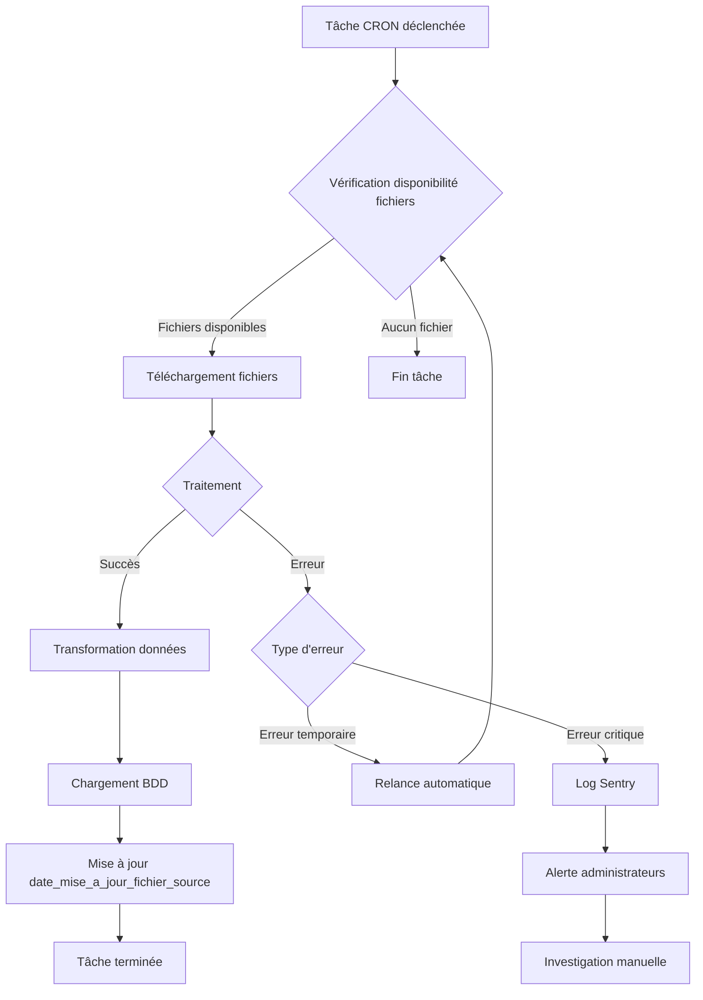

# CRON

## Présentation

Les récupérations de données sont planifiées automatiquement via des tâches CRON qui s'exécutent à intervalles réguliers.

## Configuration

La configuration des tâches CRON est définie dans le fichier `cron.json` du projet.

## Fréquences de récupération


**Planification automatique** : Les fréquences de récupération varient selon les sources de données. FINESS et Vigie RH sont récupérées quotidiennement, DIAMANT et HAPI hebdomadairement, et les données Qualité mensuellement.


### Quotidienne

- **FINESS** : mise à jour quotidienne des fichiers FINESS
- **Vigie RH** : récupération quotidienne des données DSN

### Hebdomadaire

- **DIAMANT** : récupération hebdomadaire des fichiers DIAMANT
- **HAPI** : récupération hebdomadaire des données HAPI

### Mensuelle

- **Qualité** (SIICEA, SIVSS, SIREC) : récupération mensuelle

## Exécution

### Workflow CRON

Les tâches CRON sont exécutées par le datacrawler qui :

1. Vérifie la disponibilité des nouveaux fichiers
2. Télécharge les fichiers disponibles
3. Traite et charge les données
4. Met à jour les dates de mise à jour dans `date_mise_a_jour_fichier_source`

## Gestion des erreurs


**Gestion des erreurs** : En cas d'échec, les erreurs sont automatiquement loggées dans Sentry et des alertes sont envoyées aux administrateurs pour les échecs répétés. Les tâches sont relancées automatiquement selon la configuration pour les erreurs temporaires.


- En cas d'échec, la tâche est relancée automatiquement selon la configuration
- Les erreurs sont loggées dans Sentry
- Alertes envoyées aux administrateurs en cas d'échec répété

## Voir aussi

- [SFTP/API](sftp-api.md) : mécanismes de récupération
- [Sources de données](../) : détails par source et fréquences
