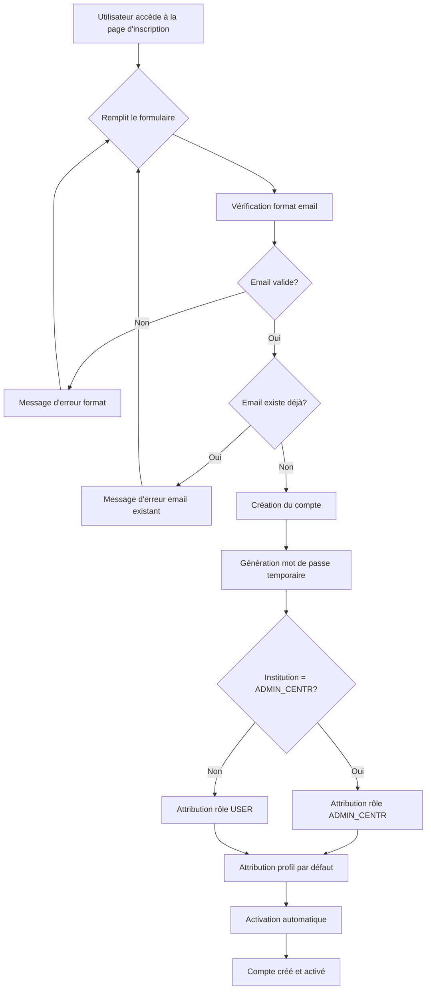

# Accès à Hélios

## URL d'accès

[Capture écran : page d'accueil avec URL]

Indiquer ici le lien URL d'accès à Hélios.

## Création de compte

### Conditions préalables


**Conditions obligatoires pour créer un compte :**

- **VPN ministère** : l'accès nécessite une connexion au VPN du ministère.
- **Format d'adresse mail autorisé** : 
  - Pour les utilisateurs ADMIN_CENTR : le domaine doit être `sg.social.gouv.fr`, `sante.gouv.fr` ou `social.gouv.fr`.
  - Pour les autres utilisateurs : format d'email conforme aux règles de l'institution.
- **PC ministère/ARS** : les PC Mac n'accèdent pas à Helios (limitation technique).


### Processus de création

[Capture écran : formulaire de création de compte]

L'utilisateur peut créer son propre compte en suivant ces étapes :

1. Accéder à la page d'inscription depuis la page d'accueil.
2. Remplir le formulaire avec :
   - Nom
   - Prénom
   - Adresse email
   - Institution (sélection dans une liste)
3. Validation du formulaire :
   - Vérification du format d'email selon l'institution sélectionnée.
   - Vérification que l'email n'existe pas déjà dans le système.
4. Création automatique du compte :
   - Attribution d'un mot de passe temporaire au format : `HeliosConnect-` + code géographique de l'institution.
   - Attribution automatique du rôle USER (ou ADMIN_CENTR si l'institution sélectionnée est ADMIN_CENTR).
   - Attribution du profil par défaut.
   - Activation automatique du compte.

#### Workflow de création de compte

### Modification des autorisations et droits

Les administrateurs régionaux et nationaux peuvent modifier les autorisations et droits des utilisateurs :

- Modification du rôle (USER, ADMIN_REG, ADMIN_NAT, ADMIN_CENTR).
- Attribution/modification des profils métiers.
- Activation/désactivation d'un compte.

[Capture écran : interface de gestion des utilisateurs pour les administrateurs]

## Matrice d'habilitation / Profils

[Capture écran : matrice d'habilitation]


La matrice d'habilitation définit les droits d'accès selon les rôles et les priorités. Les rôles avec une priorité plus faible (nombre plus élevé) ont des droits plus restreints.


La matrice d'habilitation définit les droits d'accès selon les rôles :

| Rôle | Priorité | Droits d'accès |
|------|----------|---------------|
| ADMIN_NAT | 1 | Toutes les fonctionnalités, toutes les régions, gestion des comptes et profils |
| ADMIN_REG | 2 | Toutes les fonctionnalités pour sa région, gestion des comptes régionaux |
| ADMIN_CENTR | 3 | Lecture seule, toutes les régions, pas de gestion des comptes |
| USER | 4 | Consultation, recherche, comparaison, gestion de ses propres listes |

Les profils métiers déterminent les indicateurs visibles :
- Profil financier : blocs Budget & Finances
- Profil RH : blocs Ressources Humaines
- Profil qualité : blocs Qualité, Réclamations, Inspections
- Profil activité : blocs Activité

## Comptes inactifs


**Désactivation automatique** : Un compte est automatiquement désactivé après **6 mois d'inactivité** (basé sur la date de dernière connexion `ut_date_last_connection`).


[Capture écran : message de compte désactivé]

Pour réactiver un compte désactivé, contacter un administrateur régional ou national.

## Mot de passe oublié

### Points d'entrée

Le mot de passe peut être réinitialisé depuis deux points d'entrée :

1. **Page d'accueil** : lien "Mot de passe oublié" dans le formulaire de connexion.
2. **Menu** : option "Mot de passe oublié" accessible depuis le menu utilisateur.

### Processus de réinitialisation

[Capture écran : formulaire mot de passe oublié]

1. Saisir l'adresse email associée au compte.
2. Vérification de l'existence du compte.
3. Envoi d'un email de réinitialisation via Tipimail (service Younsse).
4. Clic sur le lien dans l'email (lien à durée limitée).
5. Saisie du nouveau mot de passe :
   
   **Règle importante** : l'ancien mot de passe n'est pas autorisé lors de la création d'un nouveau mot de passe. Vous devez choisir un mot de passe différent de l'ancien.
   
   - Respect des critères de complexité du mot de passe.
6. Confirmation et connexion avec le nouveau mot de passe.

[Capture écran : formulaire de création du nouveau mot de passe]

## Se déconnecter

[Capture écran : bouton déconnexion dans le menu]

Pour se déconnecter :

1. Cliquer sur le menu utilisateur (en haut à droite).
2. Sélectionner "Se déconnecter".
3. Confirmation de la déconnexion et redirection vers la page d'accueil.

La session est fermée et il faudra se reconnecter pour accéder à nouveau à Helios.
