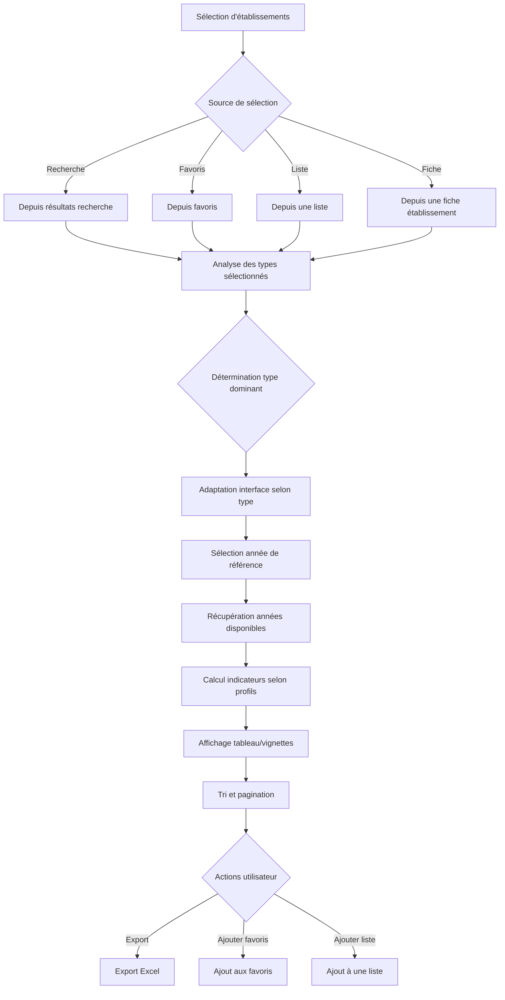

# Comparaison

## Point d'accès

[Capture écran : points d'accès à la comparaison]

La fonctionnalité de comparaison est accessible depuis plusieurs points :

- **Page de comparaison dédiée** : accessible depuis le menu principal
- **Depuis les résultats de recherche** : bouton "Comparer" sur chaque résultat
- **Depuis les favoris** : sélection multiple et comparaison
- **Depuis une liste** : ajout de la liste entière à la comparaison
- **Depuis une fiche établissement** : ajout à la comparaison

## Tableau de comparaison

### Description du tableau

[Capture écran : tableau de comparaison]

Le tableau de comparaison permet de comparer plusieurs établissements ou entités juridiques côte à côte.

#### Colonnes affichées

Les colonnes varient selon le type d'établissements sélectionnés :

**Pour les établissements sanitaires** :
- Raison sociale
- Numéro FINESS
- Commune, département
- Indicateurs d'activité (séjours, journées, passages urgences)
- Indicateurs financiers (résultat net, CAF)
- Indicateurs RH (ETP PM/PNM)
- Capacités autorisées

**Pour les établissements médico-sociaux** :
- Raison sociale
- Numéro FINESS
- Commune, département
- Indicateurs d'activité (taux d'occupation, file active)
- Indicateurs financiers (résultat net, CAF, vétusté)
- Indicateurs RH (ETP, taux d'absentéisme)

**Pour les entités juridiques** :
- Raison sociale
- Numéro FINESS
- Région
- Indicateurs consolidés (activité, finances, RH)

#### Vignettes

[Capture écran : mode vignette de comparaison]

En mode vignette, chaque établissement est présenté dans une carte avec les indicateurs principaux et un bouton pour voir la fiche détaillée.

### Fonctionnalités du bouton Actions

[Capture écran : menu Actions dans la comparaison]

Le bouton "Actions" permet :

- **Exporter la comparaison** : export Excel du tableau de comparaison avec tous les indicateurs
- **Ajouter la sélection aux favoris** : ajout groupé aux favoris
- **Ajouter la sélection à une liste** : ajout à une liste existante ou création d'une nouvelle liste
- **Réinitialiser la sélection** : vider la sélection actuelle

### Sélection et filtres

- **Sélection d'année** : choix de l'année de référence pour les indicateurs
- **Filtres par profil** : les indicateurs affichés dépendent des profils métiers de l'utilisateur
- **Tri** : tri par colonne (croissant/décroissant)
- **Pagination** : navigation entre les pages de résultats

### Limites


**Limite de sélection** : maximum 30000 établissements par comparaison. Si vous dépassez cette limite, vous devrez réduire votre sélection.


- **Types mixtes** : si des types différents sont sélectionnés, le système détermine automatiquement le type dominant et adapte l'affichage

## Règles de fonctionnement

### Détermination automatique du type


Le système détermine automatiquement le type dominant (sanitaire, médico-social, entité juridique) parmi les établissements sélectionnés et adapte l'interface en conséquence.


Dès que la sélection comporte un type dominant (sanitaire, médico-social, entité juridique), l'interface se réadapte :
- Grilles de comparaison adaptées
- Filtres spécifiques au type
- Wording adapté

#### Workflow de comparaison

### Cohérence des données

- Les règles de tri et de pagination sont centralisées côté serveur pour garantir la cohérence entre l'écran, l'export Excel et les API.
- Les indicateurs affichés respectent les autorisations définies par les profils métiers.

### Enveloppes budgétaires

Pour les établissements sanitaires, le système calcule automatiquement les "top enveloppes" (enveloppes budgétaires les plus importantes) pour faciliter la comparaison.

## Export Excel

[Capture écran : export Excel]


L'export Excel est particulièrement utile pour réaliser des analyses approfondies ou partager les résultats de comparaison avec d'autres équipes. Le fichier inclut tous les indicateurs disponibles selon vos profils métiers.


L'export Excel génère un fichier avec :
- Tous les établissements sélectionnés
- Tous les indicateurs disponibles selon les profils
- Les dates de mise à jour des sources
- Formatage adapté pour faciliter l'analyse
