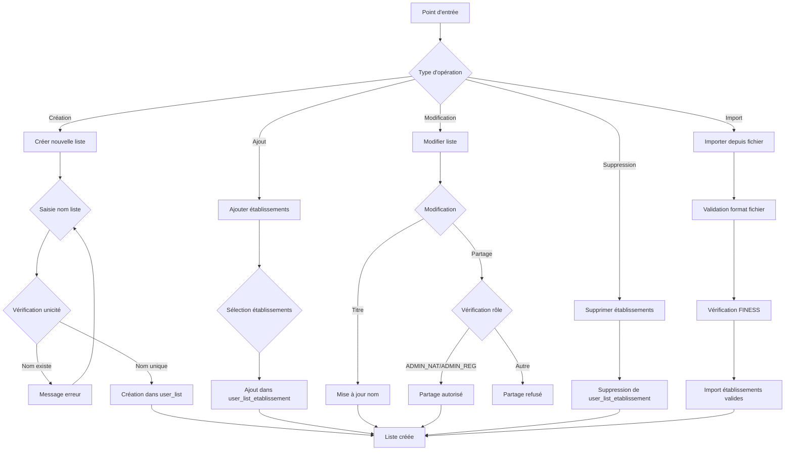

# Gestion des listes

Les listes permettent de sauvegarder des sélections d'établissements pour un usage ultérieur, le partage avec des collègues, ou la préparation de comités et analyses.

## Fonctionnalités

- **[Création d'une liste](creation-liste.md)** : créer une nouvelle liste d'établissements
- **[Ajout d'un établissement](ajout-etablissement.md)** : ajouter un établissement à une liste existante
- **[Ajout de plusieurs établissements](ajout-plusieurs-etablissements.md)** : ajout groupé d'établissements
- **[Suppression d'un établissement](suppression-etablissement.md)** : retirer un établissement d'une liste
- **[Suppression de plusieurs établissements](suppression-plusieurs-etablissements.md)** : suppression groupée
- **[Gestion d'une liste](gestion-liste.md)** : modifier le titre, supprimer une liste, actions disponibles
- **[Import d'établissements](import-etablissements.md)** : importer une liste depuis un fichier FINESS

## Workflow de gestion des listes

## Traçabilité

Chaque liste conserve :
- Le nom de l'auteur
- La date de création
- Les numéros FINESS des établissements inclus
- La date de dernière modification

## Partage


Seuls les rôles habilités (ADMIN_NAT, ADMIN_REG) peuvent partager une liste à l'échelle régionale ou nationale. Les utilisateurs USER peuvent uniquement créer et gérer leurs propres listes privées.

