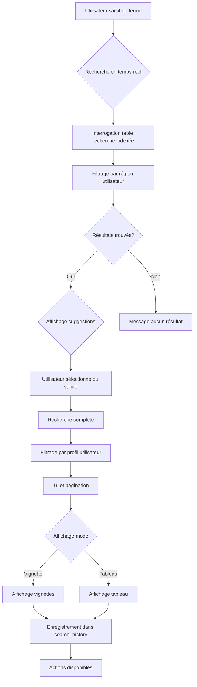

# Recherche simple

## Règles de fonctionnement

[Capture écran : formulaire de recherche simple]

La recherche simple permet de rechercher rapidement un établissement ou une entité juridique en saisissant :

- Le nom ou la raison sociale (recherche textuelle).
- Le numéro FINESS (recherche exacte).

### Comportement de la recherche


La recherche s'effectue dans la table `recherche` qui est une vue indexée sur plusieurs critères (raison sociale, termes, géographie, type). Cette indexation permet des recherches rapides et performantes.


- La recherche est effectuée en temps réel (suggestions au fur et à mesure de la saisie).
- La recherche s'effectue dans la table `recherche` qui est indexée sur :
  - Raison sociale courte
  - Termes de recherche
  - Commune, département, région
  - Type d'établissement
- Le filtrage par région est appliqué automatiquement selon le profil de l'utilisateur.
- Les résultats sont limités et paginés pour garantir les performances.

#### Workflow de recherche

### Suggestions

Des suggestions apparaissent pendant la saisie pour guider l'utilisateur :

- Noms d'établissements correspondants.
- Numéros FINESS correspondants.
- Catégories FINESS suggérées.

[Capture écran : suggestions de recherche]

## Affichage des résultats

### Mode vignette

[Capture écran : résultats en mode vignette]

En mode vignette, chaque résultat affiche :

- Raison sociale courte.
- Numéro FINESS.
- Type d'établissement (sanitaire, médico-social, entité juridique).
- Commune et département.
- Catégorie d'établissement.
- Icônes d'action : voir la fiche, ajouter aux favoris, ajouter à une liste.

### Mode tableau

[Capture écran : résultats en mode tableau]

En mode tableau, les résultats sont présentés dans un tableau avec colonnes :

- Raison sociale
- Numéro FINESS
- Type
- Commune
- Département
- Catégorie
- Actions (voir fiche, favoris, liste)

Le tableau permet :
- Le tri par colonne.
- La sélection multiple d'établissements.
- L'export des résultats sélectionnés.

### Basculement entre les modes

[Capture écran : boutons de basculement vignette/tableau]

L'utilisateur peut basculer entre les deux modes d'affichage à tout moment via des boutons dédiés.

## Actions disponibles depuis les résultats

- **Voir la fiche** : accès direct à la fiche détaillée de l'établissement ou de l'entité juridique.
- **Ajouter aux favoris** : sauvegarde dans les favoris de l'utilisateur.
- **Ajouter à une liste** : ajout à une liste existante ou création d'une nouvelle liste.
- **Comparer** : ajout à la sélection pour comparaison.

## Cas limites

- Aucun résultat trouvé : message explicite affiché avec suggestions de recherche alternative.
- 
**Trop de résultats** : Si la recherche retourne trop de résultats, utilisez la recherche avancée avec des filtres supplémentaires (type d'établissement, région, département) pour affiner votre recherche.

- Erreur de recherche : message d'erreur avec possibilité de réessayer.
